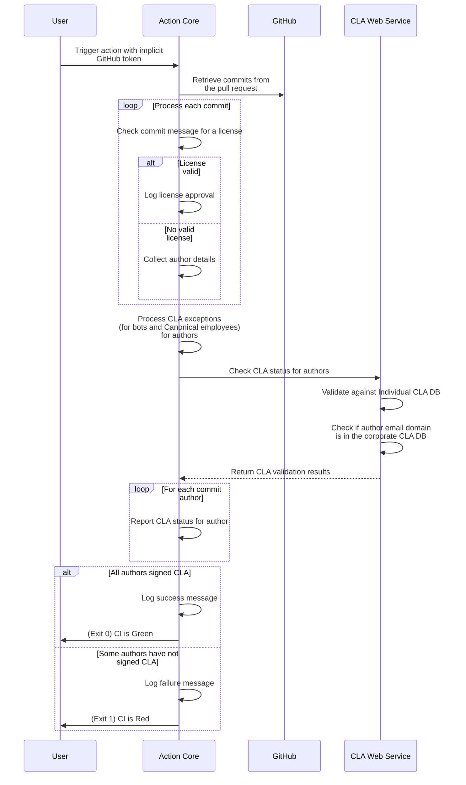

Following diagram describes the interaction of a User with CLA CI Action.

```mermaid
sequenceDiagram
    participant User as User
    participant Core as Action Core
    participant GitHub as GitHub
    participant CLAService as CLA Web Service

    User->>Core: Trigger action with implicit<br> GitHub token
    Core->>GitHub: Retrieve commits from<br> the pull request

    loop Process each commit
        Core->>Core: Check commit message for a license
        alt License valid
            Core->>Core: Log license approval
        else No valid license
            Core->>Core: Collect author details
        end
    end

    Core->>Core: Process CLA exceptions<br> (for bots and Canonical employees)<br> for authors

    Core->>CLAService: Check CLA status for authors
    CLAService->>CLAService: Validate against Individual CLA DB
    CLAService->>CLAService: Check if author email domain<br> is in the corporate CLA DB
    CLAService-->>Core: Return CLA validation results

    loop For each commit author
        Core->>Core: Report CLA status for author
    end
    
    alt All authors signed CLA
        Core->>Core: Log success message
        Core->>User: (Exit 0) CI is Green
    else Some authors have not signed CLA
        Core->>Core: Log failure message
        Core->>User: (Exit 1) CI is Red
    end

```